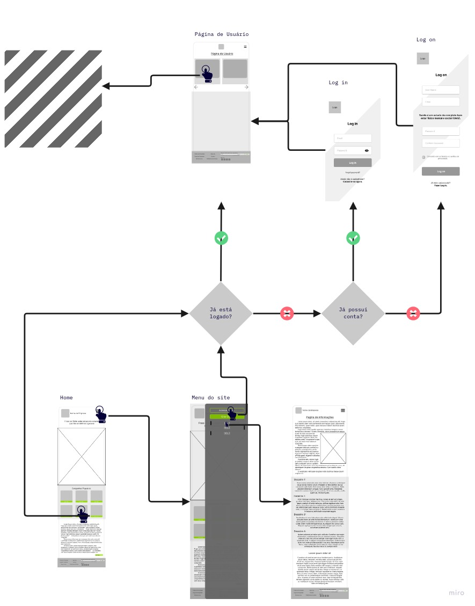
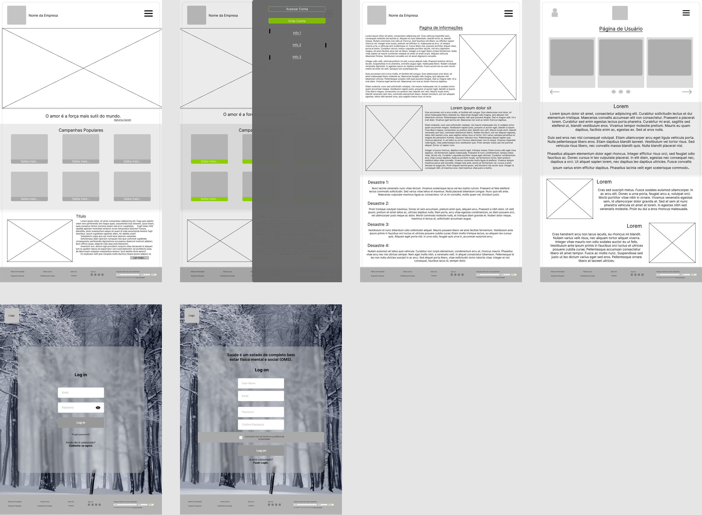
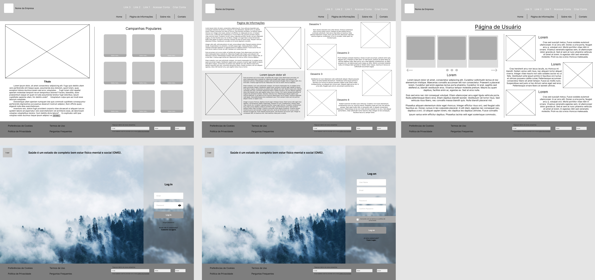

# Informações do Projeto

`Doação Express`  

Trabalho Interdisciplinar - Aplicacões Web

`Ciência da Computação`

1º semestre de 2022

### Prazo para Confecção

> Março de 2022 até Julho de 2022

## Participantes

Os membros do grupo são:

- Arthur Souza Grossi
- Bruno Santiago de Oliveira
- Fernando Campos Silva Dal´Maria
- Gabriel Frederico Vieira Silva
- João Víctor de Barros Scarmato Reis
- Larissa de Castro Reis e Silva
- Rafael Fleury Barcellos Ceolin de Oliveira

# Estrutura do Documento

- [Informações do Projeto](#informações-do-projeto)
  - [Participantes](#participantes)
- [Estrutura do Documento](#estrutura-do-documento)
- [Introdução](#introdução)
  - [Problema](#problema)
  - [Objetivos](#objetivos)
  - [Justificativa](#justificativa)
  - [Público-Alvo](#público-alvo)
- [Especificações do Projeto](#especificações-do-projeto)
  - [Personas e Mapas de Empatia](#personas-e-mapas-de-empatia)
  - [Histórias de Usuários](#histórias-de-usuários)
  - [Requisitos](#requisitos)
    - [Requisitos Funcionais](#requisitos-funcionais)
    - [Requisitos não Funcionais](#requisitos-não-funcionais)
  - [Restrições](#restrições)
- [Projeto de Interface](#projeto-de-interface)
  - [User Flow](#user-flow)
  - [Wireframes](#wireframes)
- [Metodologia](#metodologia)
  - [Divisão de Papéis](#divisão-de-papéis)
  - [Ferramentas](#ferramentas)
  - [Controle de Versão](#controle-de-versão)
- [**############## SPRINT 1 ACABA AQUI #############**](#-sprint-1-acaba-aqui-)
- [Projeto da Solução](#projeto-da-solução)
  - [Tecnologias Utilizadas](#tecnologias-utilizadas)
  - [Arquitetura da solução](#arquitetura-da-solução)
- [Avaliação da Aplicação](#avaliação-da-aplicação)
  - [Plano de Testes](#plano-de-testes)
  - [Ferramentas de Testes (Opcional)](#ferramentas-de-testes-opcional)
  - [Registros de Testes](#registros-de-testes)
- [Referências](#referências)

# Introdução

O planeta Terra absorve parte da radiação solar que chega até sua superfície e a libera em forma de radiação infravermelha. O dióxido de carbono (CO2) é um dos gases presentes na atmosfera que contribuí para reter a radiação infravermelha emitida pela Terra e consequentemente manter a temperatura do planeta relativamente constante. Infelizmente o impacto acumulado da vida humana em nosso planeta nas últimas décadas aumentou significativamente os níveis de CO2 na atmosfera e levou a uma elevação da temperatura média da Terra. Ao aumento da temperatura média da superfície da Terra damos o nome de “Aquecimento Global”.(1, 2)

A queima de combustíveis fosseis, assim como o desmatamento contribuem para o aumento de CO2 na atmosfera e consequentemente, contribuem para o aquecimento global. Mudanças climáticas por todo o mundo estão contribuindo para a ocorrência de eventos climáticos extremos, como inundações, tempestades, secas, crises hídricas, furacões e incêndios descontrolados.(1, 2)

No Brasil a ineficiência de políticas ambientais e o descaso do governo com relação ao meio ambiente contribuíram e contribuem fortemente para a ocorrência de queimadas, desmatamento e para o aumento da poluição. Além disso o governo também diminuiu seus investimentos na política de prevenção de desastres naturais. A situação do país é alarmante e com o aumento gradativo da intensidade e da frequência dos desastres naturais, devido ao aquecimento global, a população brasileira pode estar prestes a vivenciar uma série de catástrofes.(5, 9, 14)

Os moradores de áreas urbanas, principalmente aqueles mais pobres, são extremamente vulneráveis aos eventos climáticos. As precipitações de alta intensidade e os deslizamentos de terra configuram riscos elevados para essas populações, devido à impermeabilização do solo e à falta de planejamento urbano. A ocorrência de desastres naturais aumenta a taxa de mortalidade e prejudica a economia e a infraestrutura da região afetada, além disso a população vítima do desastre sofre com a falta de dinheiro, alimentos, recursos e abrigo, configurando um grupo de risco para doenças infecciosas bacterianas ou virais, parasitoses e intoxicações.(2, 5, 9)

Com a ocorrência de desastres naturais, muitas vezes é necessária a arrecadação de doações para auxiliar as vítimas. As campanhas de doções geralmente são orquestradas por órgão estatais como as prefeituras, em outros casos campanhas de doações são abertas por entidades religiosas ou através da iniciativa privada. Infelizmente muitas dessas campanhas acabam tendo problemas com sua divulgação ou acabam não sendo direcionadas para a população mais afetada. Portanto é com a finalidade de facilitar a divulgação e a arrecadação de doações financeiras ou materiais para as vítimas de tragédias naturais que este projeto está sendo desenvolvido.

## Problema

**Como facilitar a arrecadação de doações, não empresariais, para instituições que auxiliam vítimas de desastres naturais no Brasil?**

## Objetivos

### Objetivo Geral

Facilitar o acesso do usuário à campanhas de doações financeiras ou materiais para vítimas de desastres naturais.

### Objetivos Específicos

•	Permitir que o usuário identifique quais locais e populações foram mais afetados pelos desastres climáticos em determinada região.
•	Facilitar o acesso do usuário a campanhas de doações financeiras ou materiais para vítimas de desastres naturais.
•	Promover a solidariedade e a empatia.
•	Dar voz e espaço para a divulgação de campanhas de doações.
•	Auxiliar indiretamente [redirecionando o usuário para campanhas de doações regionais adequadas] vítimas de desastres naturais no Brasil.
•	Proporcionar ao usuário um direcionamento eficaz para sua doação (para quem e para qual região doar).

## Justificativa

Os desastres podem ser classificados em 2 tipos: naturais ou artificiais. O primeiro também pode ser categorizado como: desastre geofísico, hidrológico, climatológico, meteorológico ou biológico. No período de 1994 a 2013 mais de 218 milhões de pessoas foram afetadas por mais de 6000 desastres naturais. Dentre esses desastres podemos contabilizar terremotos, tsunamis, tufões, terremotos e inundações. Eventos que causam uma alta mortalidade e induzem o deslocamento massivo da população afetada. O deslocamento residencial e a exposição à desastres naturais são associados tanto a doenças infecciosas e psicológicas quanto a doenças crônicas. Além disso a ausência de empregos e a falta de segurança também são problemas que atingem essas populações.(15)

Nas últimas décadas o aumento da temperatura da atmosfera e o aumento dos desastres naturais tem configurado um problema crítico para a saúde global. Infelizmente a maior frequência desses desastres nos últimos anos tem desencadeado outro problema chamado de “fadiga dos doadores”. Essa questão está relacionada ao acúmulo sem precedentes de eventos catastróficos em escala nacional e internacional, fazendo com que os doadores não consigam arrecadar quantias tão significativas para auxiliar as vítimas dos desastres.(15, 16) Veja o exemplo abaixo retirado do artigo de Benevolenza M. A. e DeRigne L.:

_“A World Vision International, uma grande fornecedora de ajuda em desastres em todo o mundo, relata uma diminuição acentuada nas doações em dinheiro, começando em pouco menos de quatro milhões para o furacão Harvey no Texas, US$ 900.000 para o furacão Irma no Caribe e na Flórida, US$ 150.000 para o terremoto no México matando 340 pessoas e para apenas cerca de US$ 100.000 para o furacão Maria em Porto Rico.” (16)_

As populações expostas à desastres naturais, principalmente as minorias e a população de baixa renda, sofrem com a perda de seus bens materiais, de suas casas, de sua saúde física e/ou mental e, em alguns casos, com a perda de familiares. No Brasil vemos nos últimos anos um número cada vez maior de catástrofes ambientais e, consequentemente, um número de vítimas proporcional. Entretanto as políticas públicas voltadas para o meio ambiente e para as populações afetadas pelos desastres não são eficientes e são insuficientes. Por esse motivo a ação dos doadores no país é de extrema importância. Dessa forma este projeto pretende facilitar a ação dos doadores e incentivar o aumento do número de doações para vítimas de desastres naturais no Brasil.(2, 5, 14, 15, 16)

## Público-Alvo

O público-alvo para este projeto é composto por uma fatia demográfica da população brasileira disposta a realizar doações financeiras ou materiais para instituições públicas, religiosas ou privadas que estejam orquestrando campanhas de doações para vítimas de desastres naturais no Brasil. Dessa forma como características para o nosso público-alvo temos: 

1.  Idade: Pessoas maiores de 18 anos.
2.	Sexo (biológico): homens e mulheres.
3.	Poder aquisitivo/classe social: classe média baixa, classe média alta e pessoas com alto poder aquisitivo.
4.	Nacionalidade: brasileiros.
5.	Pessoas com condição, hábito ou intenção de realizar doações.

O público-alvo selecionado para o projeto será melhor avaliado durante o processo de design thinking. Dessa forma, com as entrevistas, serão elaboradas personas, ou seja, modelos de consumidores ideais para nosso projeto. Finalmente com o projeto de design thinking em mãos para orientar a confecção do projeto iremos iniciar o desenvolvimento do site. 

 
# Especificações do Projeto

- O projeto conta com entendimento das dúvidas, certezas e suposições a respeito do problema enfrentado, mapeamento das principais pessoas envolvidas no problema, perfis fictícios do cliente ideal, um mapeamento desses perfis, algumas ideias abordadas para a resolução do projeto e uma entrevista com pessoas reais que deram a base para a criação dos perfis de clientes. As técnicas utilizadas para estes itens foram: uma Matriz de alinhamento CSD, Mapa de Stakeholders, Personas (com detalhamento de Objetos e Lugares, Objetivos Chave e Como devemos tratá-la), Mapa de Empatia, BrainStorming de ideias, Mural de Possibilidades, Priorização de Ideias, Detalhamento das Ideias, Entrevista Qualitativa e Hightlights de pesquisa, respectivamente. Por fim, vale ressaltar que todas as técnicas citadas acima foram realizadas com a aplicação da metodologia Scrum.

## Personas e Mapas de Empatia

### Persona - Mateus Lourenço Silva

Por trabalhar com Engenharia de Produção, Mateus está habituado a usar seu notebook e seu celular. Durande o dia a dia, em seu ambiente de trabalho, ele utiliza frequentemente ambos os aparelhos. Além disso, para lazer, Mateus costuma chegar em casa e utilizar seu telefone para acessar conteudos recreativos.

1. Idade: 35.

2. Hobby: Trabalhos voluntário, ler, cozinhar, andar de blicicleta.

3. Trabalho: Engenharia de Produção.

4. Personalidade: Humilde, caridoso, calmo e
organizado.

5. Sonhos: Tem um sonho desde novo em
abrir um restaurante.

#### Objetos e Lugares: Os principais objetivos de Mateus durante a utilização do serviço é realizar generosas doações para individuos necessitados e acompanhar casos de desastres recentes. O serviço oferece exatamente o que Mateus procura, dando liberdade para o mesmo realizar suas doações.

#### Objetivos Chave: Mateus se sente bem quando vê resultados dos seus investimentos, mostrando imagens e dados que comprovem que seus investimentos conseguiram transformar a vida das pessoas.

#### Mapa de Empatia.

1. O que ele pensa e sente: Tende a confiar demais nos outros. Se sente pressionado a continuar no emprego em que está ao invés de seguir carreira administrativa e culinária. Tem medo de morrer sem ter feito a diferença no mundo e sonha demais, pensando se tudo o que ele faz pelos outros não é em vão. Anseia viver uma vida feliz e trabalhar com o que gosta. espera doar comida se abrir um restaurante.

2. O que ele vê: Seus pais são muito presentes na vida dele mesmo já sendo independente a anos.  Ele tem muitos amigos, mas nenhum realmente próximo ao qual confia seus maiores segredos ou que pode contar a qualquer momento. A área na qual ele atua em seu emprego é muito boa e o salário é estável. A Engenharia de Produção tem ganhado espaço no mercado e mais oportunidades surgem para ele.

3. O que ele diz e faz: Ele faz trabalho voluntário, gosta de fazer doações mensais para instituições de ajuda aos necessitados, anda de bicicleta, ama cozinhar e quer abrir um restaurante. Gasta mais dinheiro com outras pessoas do que com si mesmo. Seu comportamento em frente aos outros é calmo, humilde, conformado e caridoso, tentando nunca levantar a voz. Sua aparência é simples, cabelo curto, estatura média, veste roupa social, passa um perfume suave e quando vai andar de bicicleta utiliza os equipamentos e as roupas recomendadas para tal.

4. O que ele ouve: Seus amigos dizem que ele se preocupa demais com a vida dos outros e se preocupa demais com a opinião que seus pais tem sobre suas decisões. Seu chefe acredita que ele ainda teria uma carreira de grande sucesso na área atual e o incentiva a não largar o emprego.

### Persona - Samuel Silveira da Silva

Samuel está habituado a utilizar seu celular em seus intervalos de trabalho. O mesmo, durante seu tempo livre, tem o costume de ler livros e jornais impressos, com o intuito de se informar sobre as atualidades e novas tendencias tecnológicas. Em casa, está habituado a assistir televisão.

1. Idade: 33.

2. Hobby: Cuidar de sua horta pessoal e ir a restaurantes com sua esposa.

3. Trabalho: Cirurgião Geral.

4. Personalidade: Gentil, atencioso, extrovertido e calmo.

5. Sonhos: Sonha com um mundo justo.

#### Objetos e Lugares: Samuel busca realizar doações de maneira rápida e facil, tendo várias opções de instituições para doar e diversas causas de desastres naturais. O serviço se adequa a ele pois é agil e intuitivo, tornando a experiencia de usuário agradavel e eficiente.

#### Objetivos Chave: Samuel se sente bem quando lê depoimento de pessoas que foram ajudadas pelas doações dentro do site. Gosta quando são educados com ele e quando  mostram empatia.

#### Mapa de Empatia.

1. O que ele pensa e sente: Samuel se importa muito com o que os outros pensam dele, assim se sentindo pressionado a ajudar os próximos, muitas vezes em formas de doações. Anseia por um mundo melhor e se inspira em grandes figuras de paz e pessoas que lutaram pela paz no mundo como, Gandhi e Martin Luther King.

2. O que ele vê: Por causa da sua natureza extremamente extrovertida, Samuel formou muitos amigos, porém nenhum deles é muito próximo. No seu ambiente, ele enxerga uma dificuldade no momento de realizar suas doações e não encontra meios para facilitar essa tarefa.

3. O que ele diz e faz: Em público Samuel é gentil e extrovertido e adora ser o centro das atenções, tentando garantir que todos gostem dele. Quando se trata de aparência ele se veste coerentemente a alguém de sua classe social (alta).

4. O que ele ouve: Seus amigos o consideram uma das pessoas mais caridosas e bondosas que eles conhecem, já o seu chefe além de concordar com as afirmações anteriores o considera extremamente prestativo e um ótimo profissional.

### Persona - Flora Alves Conceição

Dona Flora está habituada a utilizar seu aparelho celular e ler jornais. Em seu tempo livre, gosta de ler noticias nos jornais e compartilha-las em seu aparelho celular.

1. Idade: 53.

2. Hobby: Costura panos de prato e toalhas de mesa como hobby e fonte de renda extra.

3. Trabalho: Servidora pública.

4. Personalidade: Forte, caridosa, humilde e batalhadora.

5. Sonhos: Sonha em ter sua casa propria e dar um bom futuro para seus netos.

#### Objetos e Lugares: Dona Flora busca poder ajudar as pessoas que foram vitimas de desastres naturais, ja que quando era menor, a mesma foi vitima de inumeras chuvas que acarretaram na perda de sua moradia e bens. Com o serviço, ela pode ajudar pessoas ao redor de todo o país utilizando apenas seu aparelho celular.

#### Objetivos Chave: Dona Flora se sente bem quando consegue conversar e ouvir as experiencias das pessoas que foram vitimas de desastres e saber que com o que ela está doando, pode fazer a diferença.

#### Mapa de Empatia.

1. O que ela pensa e sente: Sente que não tem muito tempo a perder devido a idade avançada por isso se preocupa em adquirir uma moradia própria para não
se preocupar mais com o aluguel no final do mês sua maior inspiração é sua irmã, que conseguiu adquirir sua casa própria e ter estabilidade financeira aos 50 anos.

2. O que ela vê: Vê que sua luta é bem parecida com a luta dos seus amigos e familiares, todos buscam ter ao menos o básico de forma que não precisem se preocupar com moradia e locomoção. O mercado oferece algumas oportunidades para que a realização desses desejos sejam alcançados porém são poucas e raramente conquistadas por alguém sem estudo como Flora.

3. O que ela diz e faz: Diz que é grata pela vida que tem mesmo trabalhando muito e bem comportada e humilde, sempre correndo mas muito atenciosa. Flora tem 1,50 de altura, e magra, tem cabelo curto e ondulado, e parda e usa óculos.

4. O que ela ouve: Os amigos dizem que esta cada vez mais difícil conquistas as coisas mas acredita que vai melhorar com novos governantes na politica. Ouve muito sobre empatia, pois em seu meio isto e comum no dia a dia, principalmente diante de tantas dificuldades. O chefe diz que ela e esforçada e trabalhadora mas que deveria fazer cursos de atualização para ter mais oportunidades em sua empresa.

## Histórias de Usuários

Com base na análise das personas forma identificadas as seguintes histórias de usuários:

|EU COMO... `PERSONA`| QUERO/PRECISO ... `FUNCIONALIDADE` |PARA ... `MOTIVO/VALOR`                 |
|--------------------|------------------------------------|----------------------------------------|
|Usuário do sistema | Doações de forma rápida e fácil | Ter uma experiência intuitiva e eficiente com o serviço |
|Usuário do sistema | Acompanhar casos de desastres recentes | Fazer doações para pessoas mais necessitadas |
|Usuário do sistema | Fazer doações de forma simples pelo celular | Ter acessibilidade ao serviço |

## Requisitos

As tabelas que se seguem apresentam os requisitos funcionais e não funcionais que detalham o escopo do projeto.

### Requisitos Funcionais

|ID    | Descrição do Requisito  | Prioridade |
|------|-----------------------------------------|----|
|RF-001| Permitir que o usuário faça cadastro e login no site | ALTA | 
|RF-002| Permitir ao usuário identificar as campanhas mais prioritárias | Alta |
|RF-003| Permitir ao usuário identificar as campanhas que mais atendem seus interesses | Média |
|RF-004| A home deve apresentar informações sobre a importância das doações e sobre como e para quem realizar doações. | Alta |
|RF-005| Usuários cadastrados poderão acumular pontos ao acessar páginas sobre campanhas de doações ou ao compartilhar campanhas de doações nas redes sociais | Baixa |
|RF-006| O site deve fornecer informações relevantes sobre os riscos de desastres naturais em sua região | Média |
|RF-007| Deverá fornecer informações sobre como ajudar pessoas passando por necessidade devido a algum evento climático desastroso | Média |

### Requisitos não Funcionais

|ID     | Descrição do Requisito  |Prioridade |
|-------|-------------------------|----|
|RNF-001| O sistema deve ser responsivo para rodar em um dispositivo móvel | Alta | 
|RNF-002| O site deverá ter um banco de dados para suportar o cadastro de possíveis usuários | Alta | 
|RNF-003| O site deverá ter um sistema que atualiza as campanhas de doação com base nos sites oficiais das instituições | Baixa |
|RNF-004| O site deverá ter um sistema e/ou Cookies que rastreeiem quando o usuário acessar páginas sobre campanhas de doações ou ao compartilhar campanhas de doações nas redes sociais para que os pontos sejam acumulados | Baixa |
|RNF-005| Deverá ter um sistema que identifique a localização do usuário no mapa para fornecer informações sobre desastres na região do mesmo | Média |

## Restrições

O projeto está restrito pelos itens apresentados na tabela a seguir.

|ID| Restrição                                             |
|--|-------------------------------------------------------|
|01| O projeto deverá ser entregue até o final do semestre |
|02| Não pode ser desenvolvido um módulo de backend        |
|03| O site inicialmente não irá atingir públicos fora do país|
|04| As pesquisas realizadas para a confecção do trabalho não apresentam amostras grandes |
|05| O projeto não irá lidar diretamente com as vítimas de desastres, apenas com os doadores |

# Projeto de Interface

Uma das principais necessidades do projeto é facilitar o acesso de doadores às campanhas de doação. Para tal, foi desenvolvido uma interface amigável e fácil de navegar entre projetos e existes de ajuda humanitária.

## User Flow

Fluxo de usuário (User Flow) é uma técnica que permite ao desenvolvedor mapear todo fluxo de telas do site ou app. Essa técnica funciona para alinhar os caminhos e as possíveis ações que o usuário pode fazer junto com os membros de sua equipe.

## Wireframes

O wireframe foi desenvolvido seguindo a metodologia mobile-first para garantir uma interface amigavel para o usuário. Em seguida, o produto foi adaptado para as demais plataformas: tablet e desktop.

# Metodologia

## Metodologia Bibliográfica

Trata-se de um projeto social cuja operacionalização iniciou-se com um levantamento bibliográfico focado nos principais aspectos que causam ou influenciam o problema e nas principais causas do problema. A pesquisa bibliográfica se deu através da consulta as bases de dados: “Scielo, Google Scholar e IEEE Explore”. Para a efetivação das buscas os seguintes descritores em inglês foram utilizados: “global warming, greenhouse effect, natural disasters, consequences, causes e brazil”. Os descritores apresentados foram combinados de diferentes formas para ampliar os resultados das buscas e consequentemente melhorar a qualidade e o aproveitamento dos artigos selecionados. 

Como critérios de inclusão temos: (1) artigos publicados de 2017 a 2022, com destaque àqueles estudos concluídos no ano de 2020; (2) artigos publicados em inglês; (3) artigos experimentais, com estudo bem documentado e metodologia comprovada; (4) artigos de revisão e artigos de revisão sistemática com metodologia comprovada; (5) artigos que contemplavam causas e consequências do aquecimento global; (6) artigos experimentais e de revisão que avaliavam os riscos, as consequências e as implicações dos desastres naturais, principalmente aqueles artigos voltados para o Brasil. Vale ressaltar que este projeto de pesquisa não incluiu todos os artigos encontrados nas bases. 

Como critérios de exclusão temos: (1) artigos publicados antes de 2017, publicações com conflito de interesse ou publicações com metodologia deficitária; (2) artigos que contemplem apenas a química e a física envolvida no aquecimento global; (3) artigos que apenas relacionem o aquecimento global com a fisiologia e/ou com a bioquímica do corpo humano; (4) editoriais ou relatos de caso; (5) artigos relacionados somente com a botânica; (6) artigos com foco em geopolítica. 

A pesquisa bibliográfica inicial levantou 10 artigos principais até o momento, todos voltados para problemas climáticos, aquecimento global, desastres naturais no Brasil e/ou impactos das mudanças climáticas para sociedade e para o estado. Além desses textos, 4 reportagens foram selecionadas no portal G1 da globo.com para auxiliar na exemplificação do problema e dos impactos dos desastres naturais no Brasil. Por fim, 2 referências complementares foram adicionadas para aprofundar os temas contemplados neste arquivo.

## Metodologia Desenvolvimento

Esse projeto também faz uso da metodologia Scrum para facilitar as interações entre os membros da equipe e para aumentar a chance de sucesso do projeto. A metodologia Scrum também foi aplicada para permitir uma interação satisfatória entre aqueles que executam o trabalho e aqueles que o recebem. Durante a execução do trabalho a transparencia, a inspeção e a adaptação foram e são pilares para o desenvolvimento do produto final.   

Durante a execução da Sprint 1 o Scrum team se manteve atendo e engajado com o processo proposto pela metodologia Scrum. Realizamos Daily Scrums para inspecionar o progresso em direção a Meta da Sprint e adaptar o Sprint Backlog, além de realizarmos interações adicionais para discutir informações relevantes para a execução do projeto. A Sprint Review foi realizada para inspecionar o resultado da Sprint no dia 16/04/2022 e a Sprint Retrospective foi realizada no dia 17/04/2022 (mesmo dia da entrega do sprint backlog). Vale ressaltar que todo o trabalho concluido pela equipe durante a primeira Sprint levou em conta os principais valores do método Scrum: Compromisso, Foco, Abertura, Respeito e Coragem.

## Divisão de Papéis

### Scrum Master

* Bruno Santiago de Oliveira

### Product Owner

* Rafael Fleury

### Equipe de Desenvolvimento

* Arthur Souza Grossi
* Fernando Campos Silva Dal´Maria
* Gabriel Frederico Vieira Silva
* João Víctor de Barros Scarmato Reis
* Larissa de Castro Reis e Silva
* Rafael Fleury Barcellos Ceolin de Oliveira

## Ferramentas

A tabela subsequente contempla as principais plataformas que serão utilizadas para a confecção do projeto. Outrossim, visando melhorar a documentação do trabalho, a tabela também apresenta as principais tecnologias e linguagens que serão utilizadas em cada plataforma para a confecção do projeto.

| Ambiente  | Plataforma              |Link de Acesso |
|-----------|-------------------------|---------------|
|Processo de Design Thinkgin  | Miro |  https://miro.com/app/board/uXjVOFDWTFQ=/ | 
|Organização do Projeto | Trello | https://trello.com/b/KYdvkF50/tiaw |
|Repositório de código | GitHub | https://github.com/ICEI-PUC-Minas-PMGCC-TI/tiaw-pmg-cc-m-20221-tiaw-doacoes-grupo-1 | 
|Hospedagem do site | Github Pages |  https://icei-puc-minas-pmgcc-ti.github.io/tiaw-pmg-cc-m-20221-tiaw-doacoes-grupo-1/codigo/ | 
|Protótipo Interativo | MavelApp ou Figma | https://www.figma.com/file/dEjHc4jMdxp4AqojGCUbRl/WireFrame?node-id=0%3A1 | 
|Paleta de Cores | Adobe Color | https://color.adobe.com/pt/create/color-wheel | 
|Editor de Código| Visual Studio Code | https://code.visualstudio.com/ | 
|Protótipo Interativo | IEEE Explore | https://ieeexplore.ieee.org/search/searchresult.jsp?newsearch=true&queryText=computer | 
|Desenvolvimento dos Slides | Microsoft Office | https://www.microsoft.com/pt-br/microsoft-365/microsoft-office?rtc=1 | 
|Consulta de Informações | w3schools | https://www.w3schools.com/ | 
|Consulta de Informações | M mdn - mozilla | https://developer.mozilla.org/pt-BR/ | 
|Comunicação | Discord | https://discord.gg/6HQdRebb23 |
|User Flow| Miro | https://miro.com/welcomeonboard/b0FCRGQ0SVdsbXhGaHJySG1YVENoRjdjMnRmM1hoeDQ4dTFFTDl4R3VQdlJsR25sY2d5MWZKWkRLZ2NBVFdpR3wzMDc0NDU3MzUxMzkyOTA4MTk1?share_link_id=451808885641 |

## Controle de Versão

A ferramenta de controle de versão adotada no projeto foi o
[Git](https://git-scm.com/), sendo que o [Github](https://github.com)
foi utilizado para hospedagem do repositório `upstream`.

O projeto segue a seguinte convenção para o nome de branchs:

- `master`: versão estável já testada do software
- `unstable`: versão já testada do software, porém instável
- `testing`: versão em testes do software
- `dev`: versão de desenvolvimento do software

Quanto à gerência de issues, o projeto adota a seguinte convenção para
etiquetas:

- `bugfix`: uma funcionalidade encontra-se com problemas
- `enhancement`: uma funcionalidade precisa ser melhorada
- `feature`: uma nova funcionalidade precisa ser introduzida
- `documentation`: Edição da documentação
- `duplicate`: Este problema ou pull request já existe
- `enhancement`: uma funcionalidade precisa ser melhorada
- `help wanted`: É necessária atenção extra
- `invalid`: Isso não parece certo

## Hospedagem

O GitHub Pages foi escolhido para hospedar a aplicação por conta de sua integração o GitHub, a ferramenta de hospedagem de repositórios utilizada pelo projeto.

# **############## SPRINT 1 ACABA AQUI #############**

# Projeto da Solução

......  COLOQUE AQUI O SEU TEXTO ......

## Tecnologias Utilizadas

......  COLOQUE AQUI O SEU TEXTO ......

> Descreva aqui qual(is) tecnologias você vai usar para resolver o seu
> problema, ou seja, implementar a sua solução. Liste todas as
> tecnologias envolvidas, linguagens a serem utilizadas, serviços web,
> frameworks, bibliotecas, IDEs de desenvolvimento, e ferramentas.
> Apresente também uma figura explicando como as tecnologias estão
> relacionadas ou como uma interação do usuário com o sistema vai ser
> conduzida, por onde ela passa até retornar uma resposta ao usuário.
> 
> Inclua os diagramas de User Flow, esboços criados pelo grupo
> (stoyboards), além dos protótipos de telas (wireframes). Descreva cada
> item textualmente comentando e complementando o que está apresentado
> nas imagens.

## Arquitetura da solução

......  COLOQUE AQUI O SEU TEXTO E O DIAGRAMA DE ARQUITETURA .......

> Inclua um diagrama da solução e descreva os módulos e as tecnologias
> que fazem parte da solução. Discorra sobre o diagrama.
> 
> **Exemplo do diagrama de Arquitetura**:
> 
> 

# Avaliação da Aplicação

......  COLOQUE AQUI O SEU TEXTO ......

> Apresente os cenários de testes utilizados na realização dos testes da
> sua aplicação. Escolha cenários de testes que demonstrem os requisitos
> sendo satisfeitos.

## Plano de Testes

......  COLOQUE AQUI O SEU TEXTO ......

> Enumere quais cenários de testes foram selecionados para teste. Neste
> tópico o grupo deve detalhar quais funcionalidades avaliadas, o grupo
> de usuários que foi escolhido para participar do teste e as
> ferramentas utilizadas.
> 
> **Links Úteis**:
> - [IBM - Criação e Geração de Planos de Teste](https://www.ibm.com/developerworks/br/local/rational/criacao_geracao_planos_testes_software/index.html)
> - [Práticas e Técnicas de Testes Ágeis](http://assiste.serpro.gov.br/serproagil/Apresenta/slides.pdf)
> -  [Teste de Software: Conceitos e tipos de testes](https://blog.onedaytesting.com.br/teste-de-software/)

## Ferramentas de Testes (Opcional)

......  COLOQUE AQUI O SEU TEXTO ......

> Comente sobre as ferramentas de testes utilizadas.
> 
> **Links Úteis**:
> - [Ferramentas de Test para Java Script](https://geekflare.com/javascript-unit-testing/)
> - [UX Tools](https://uxdesign.cc/ux-user-research-and-user-testing-tools-2d339d379dc7)

## Registros de Testes

......  COLOQUE AQUI O SEU TEXTO ......

> Discorra sobre os resultados do teste. Ressaltando pontos fortes e
> fracos identificados na solução. Comente como o grupo pretende atacar
> esses pontos nas próximas iterações. Apresente as falhas detectadas e
> as melhorias geradas a partir dos resultados obtidos nos testes.

# Referências

1.  ZANDALINAS, S. I.; FRITSCHI, F. B.; MITTLER, R. Global Warming, Climate Change, and Environmental Pollution: Recipe for a Multifactorial Stress Combination Disaster. **Trends in Plant Science**, v. 26, n. 6, p. 588-599, jun. 2021.

2. AL-GHUSSAIN, L. Global Warming: Review on Driving Forces and Mitigation. **Environmental Progress & Sustainable Energy**, v. 38, n. 1, p. 13-21, out. 2018.

3. DUFFIE, A. J.; BECKMAN, W. A. **Solar Engineering of Thermal Processes**. 4. ed. New Jersey: Wiley, 2013.

4. NASA. Global Climate Change: Vital Signs of the Planet. Disponível em: https://climate.nasa.gov/causes/ Acesso em:  Mar 2022.

5. SCHMIDT, I. B.; ELOY, L. Fire regime in the Brazilian Savanna: recent changes, policy and management. **Flora**, v. 268, n. 151613, jul. 2020.

6. LETCHER, T. M., et al. Why do we have global warming? **Managing Global Warming**, p. 3-15. 2019.

7. ROSSATI, A. Global Warming and Its Health Impact. **The international Journal of  Occupational and Environmental Medicine**, v. 8, n. 1, p. 7-20, jan. 2017.

8. MARENGO, J. A., et al.  Extreme Rainfall and Hydro-Geo-Meteorological Disaster Risk in 1.5, 2.0, and 4.0◦C Global Warming Scenarios: An Analysis for Brazil. **Frontiers in Climate**, v. 3, n. 610433, p. 1-17, mar. 2021.

9. RODRIGUES, D. T., et al. Probability of occurrence of extreme precipitation events and natural disasters in the city of Natal, Brazil. **Urban Climate**, v. 35., p. 1-13, jan. 2021.

10. MARENGO, J. A., et al. Trends in extreme rainfall and hydrogeometeorological disasters in the Metropolitan Area of São Paulo: a review. **Annals Of The New York Academy Of Sciences**, v. 1472, n. 1, p. 5-20, fev. 2020.

11. Chuva deixa mais de 500 famílias desabrigadas, prefeito isolado e distritos inundados em Jucuruçu, na Bahia. Acesso em: 23/02/2022; Disponível em: https://g1.globo.com/ba/bahia/noticia/2021/12/10/chuva-deixa-mais-de-500-familias-desabrigadas-prefeito-isolado-e-distritos-inundados-em-jucurucu-na-bahia.ghtml.

12. Imagens aéreas mostram Itapetinga, na BA, inundada; veja situação em outras cidades do sudoeste baiano. Disponível em: https://g1.globo.com/ba/bahia/noticia/2021/12/25/imagens-aereas-mostram-itapetinga-na-ba-inundada-veja-situacao-em-outras-cidades-do-sudoeste-baiano.ghtml>. Acesso em: 21 mar. 2022.
13.  EM, T. Tragédia em Petrópolis (RJ) desperta solidariedade pelo país. Acesso em: 23/02/2022; Disponível em: https://g1.globo.com/jornal-nacional/noticia/2022/02/17/tragedia-em-petropolis-rj-desperta-solidariedade-pelo-pais.ghtml. 

14. Investimento do governo federal em prevenção de desastres naturais tem caído há dez anos. Disponível em: https://g1.globo.com/jornal-nacional/noticia/2022/02/23/investimento-do-governo-federal-em-prevencao-de-desastres-naturais-tem-caido-ha-dez-anos.ghtml. Acesso em: 21 mar. 2022. 

15. JANG, S., et al. Systematic Review of Displacement and Health Impact From Natural Disasters in Southeast Asia.  **Disaster Medicine and Public Health Preparedness**, v. 15, n. 1, p. 105-114, jan 2020.

16. BENEVOLENZA, M. A.; DERIGNE, L. The impact of climate change and natural
disasters on vulnerable populations: A systematic review of literature. **Journal of Human Behavior in the Social Environment**, v. 29, n. 2, p. 266-281, out. 2018.

17. MDN Web Docs. Disponível em: https://developer.mozilla.org/pt-BR/.

‌18. W3SCHOOLS. W3Schools Online Web Tutorials. Disponível em: https://www.w3schools.com/.

19. KEN S.; JEFF S. **The Scrum Guide: The Definitive Guide to Scrum: The Rules of the Game**. nov. 2020. Disponível em: https://scrumguides.org/docs/scrumguide/v2020/2020-Scrum-Guide-US.pdf#zoom=100. Acesso em: 11/03/2022.

20. ATLASSIAN. **Scrum — o que é, como funciona e por que é incrível**. Disponível em: <https://www.atlassian.com/br/agile/scrum>.

21. **CHAI.** Disponível em: <https://www.chaijs.com/>.
    
22. **NPM | build amazing things.** Disponível em: <https://www.npmjs.com/>.

‌23. **MOCHA - the fun, simple, flexible JavaScript test framework.** Disponível em: <https://mochajs.org/>.

> Inclua todas as referências (livros, artigos, sites, etc) utilizados
> no desenvolvimento do trabalho.
> 
> **Links Úteis**:
> - [Formato ABNT](https://www.normastecnicas.com/abnt/trabalhos-academicos/referencias/)
> - [Referências Bibliográficas da ABNT](https://comunidade.rockcontent.com/referencia-bibliografica-abnt/)